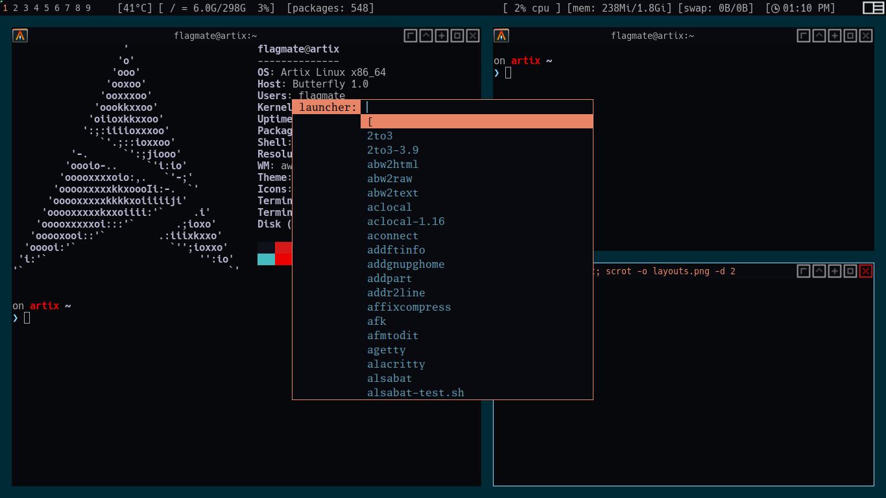

# my dotfiles

## screenshots

|                       layouts                       |                        wallpaper                        |
| :-------------------------------------------------: | :-----------------------------------------------------: |
|  |  |

## awesome config

### shortcuts

all shortcuts for awesome wm can be found in [~/.config/awesome/shortcuts.lua](.config/awesome/shortcuts.lua)

#### mod keys

- **mod4** = super key / window key
- **mod1** = alt key

#### hotkeys

- browser ( **brave-dev** ) = mod4 + control + b
- terminal ( **alacritty** ) = mod4 + t
- **close apps** = mod4 + w
- **show help** = mod4 + s
- **dmenu** = mod4 + d
- **mount usb** = mod1 + m

## neovim config

- theme = [material](https://github.com/jdkanani/vim-material-theme.git)
- plugin manager [Vundle](git clone https://github.com/VundleVim/Vundle.vim.git~/.vim/bundle/Vundle.vim)

### coc-neovim

- coc-css
- coc-eslint
- coc-highlight
- coc-html
- coc-json
- coc-lua
- coc-prettier
- coc-python
- coc-tsserver

### shortcuts

- quit (~~:wq~~ **:x**) = space + q
- save ( **:w** ) = space + s
- reload nvim = space + r
- Nerd tree = space + n
