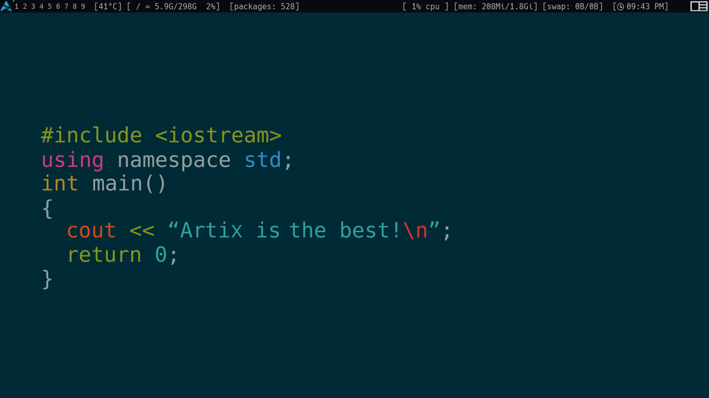

# awesome config

## mod keys

- **mod4** = super key / window key
- **mod1** = alt key

## shortcuts

- browser ( **brave-dev** ) = mod4 + control + b
- terminal ( **alacritty** ) = mod4 + t
- **close apps** = mod4 + w
- **show help** = mod4 + s
- **dmenu** = mod4 + d
- **mount usb** = mod1 + m

# screenshots

|                       layouts                       |                        wallpaper                        |
| :-------------------------------------------------: | :-----------------------------------------------------: |
|  |  |
